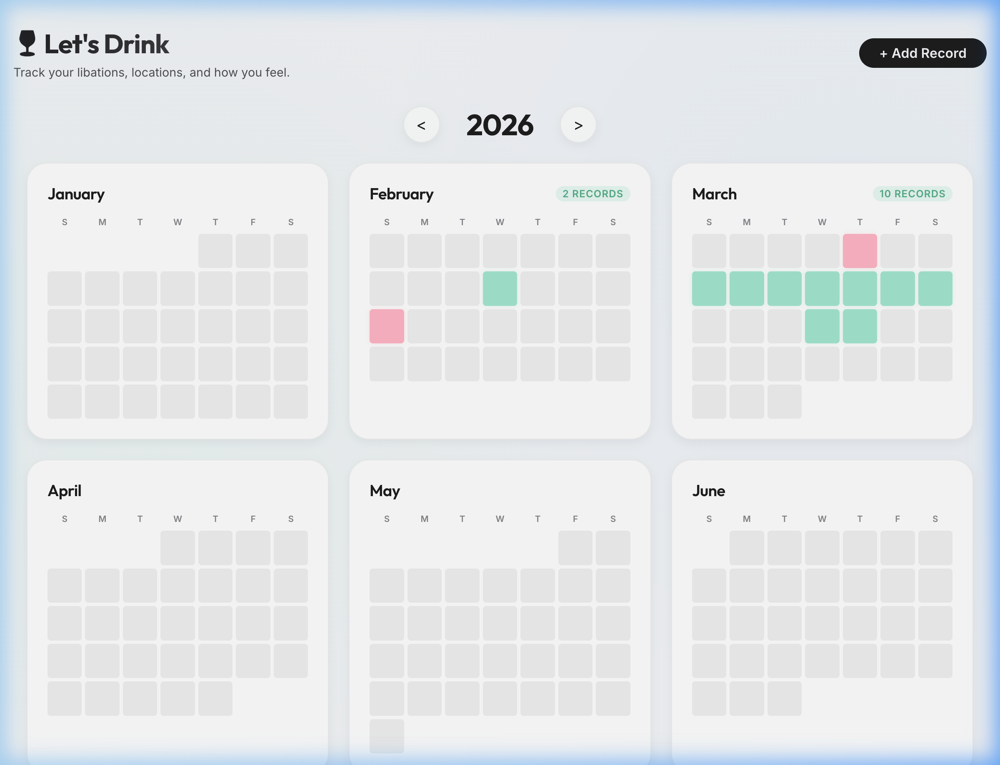

# 🍷 Let's Drink

A personal drink history tracker — log your libations, locations, companions, and how you felt the morning after.



## Features

- 📅 **Year & Month Calendar View** — Browse all records on a visual annual overview, then drill into a month calendar
- 📝 **Full Record Logging** — Date, location, people, drinks consumed, personal notes, and two mood ratings (today & day-after)
- 🖼️ **Apple-style Media Carousel** — Upload photos and videos per record; view them in a cinematic fullscreen lightbox with native trackpad swipe gestures and scroll-snap transitions
- 📸 **HEIC Support** — iPhone HEIC photos are automatically converted to JPEG on the server at upload time
- 🔍 **Record Detail Modal** — Tap any day to see a beautifully laid-out summary with all logged info
- ✏️ **Edit & Add** — Add new records or edit existing ones inline via modal forms
- 🌙 **Dark mode, glassmorphism UI** — Premium design with smooth animations throughout

## Tech Stack

| Layer | Technology |
|---|---|
| Frontend | React 19 + TypeScript + Vite |
| Styling | Vanilla CSS (glassmorphism, CSS variables, scroll-snap) |
| Backend | Node.js + Express + TypeScript |
| Database | SQLite (via `sqlite3`) |
| File Upload | Multer |
| HEIC Conversion | `heic-convert` (pure JS, no system deps) |
| Containerization | Docker + Docker Compose |

## Project Structure

```
lets-drink/
├── src/                    # React frontend
│   ├── components/
│   │   ├── Calendar/       # Month-view calendar grid
│   │   ├── YearOverview/   # Annual heatmap overview
│   │   ├── RecordModal/    # Record detail view + media carousel
│   │   └── RecordForm/     # Add/edit record form
│   ├── data/store.ts       # API client (fetch wrappers)
│   └── types.ts            # Shared TypeScript types
├── server/                 # Express backend
│   ├── src/index.ts        # All routes, HEIC conversion, SQLite logic
│   ├── uploads/            # Uploaded media files (gitignored)
│   └── data/               # SQLite database (gitignored)
├── docker-compose.yml
└── .gitignore
```

## Getting Started (Local Development)

### Prerequisites
- Node.js 18+
- npm

### 1. Install dependencies

```bash
# Frontend
npm install

# Backend
cd server && npm install
```

### 2. Run the backend

```bash
cd server
npm run dev     # starts on http://localhost:3000
```

### 3. Run the frontend (in a separate terminal)

```bash
npm run dev     # starts on http://localhost:5173
```

## Deployment (Docker)

```bash
docker-compose up --build -d
```

The app will be available on port `80` (frontend) and `3000` (API).

## Notes

- **Media files** (`server/uploads/`) and the **database** (`server/data/database.sqlite`) are excluded from Git — they live only on the server.
- **HEIC photos** from iPhone are automatically converted to JPEG at upload time; no `ffmpeg` required.
- For **Live Photos** (.mov animation), upload the `.mov` file separately — it will appear as a playable video in the media carousel.
